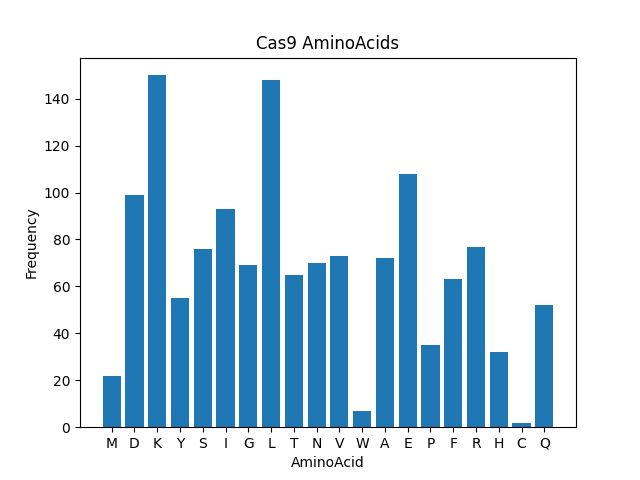
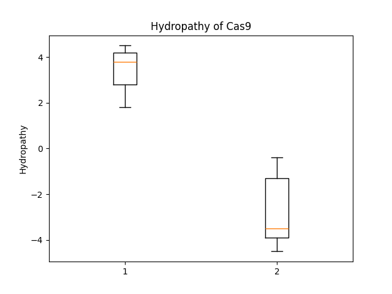

# Cas9 Protein Sequence Analysis

This project provides an analysis of the amino acid sequence of the Cas9 protein.
The analysis includes frequency calculation of each amino acid and classification of residues as hydrophobic or hydrophilic.

The Cas9 sequence used in this study was obtained from UniProt (ID: Q99ZW2).

## Visualizations

The following figures are generated by the analysis:

### Amino Acid Frequency

The bar chart above shows the frequency of each amino acid in the Cas9 protein. 
It helps to quickly see which residues are most common.

### Hydropathy (Hydrophobic vs Hydrophilic)

This boxplot shows the distribution of hydropathy values in Cas9:

- Hydrophobic residues (values >= 0) are shown in the first box. Their mean indicates the average tendency to avoid water.  
- Hydrophilic residues (values < 0) are shown in the second box. Their mean indicates the average tendency to interact with water.

## Packages Used

This project uses the following Python packages:

- pandas
- matplotlib
- collections (built-in)

